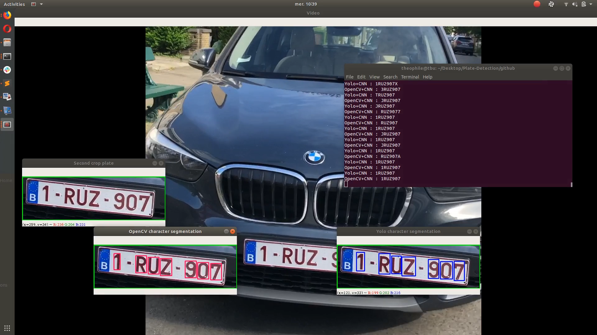

# License Plate Recognition

Libraries dependancies:
  <ul>
  <li>Tensorflow</li>
  <li>Numpy</li>
  <li>cv2</li>
  <li>imutils</li>
  </ul>
  
  <strong>You can run the demo by running "python3 finalProtoype.py"</strong>
  
  
In Yolo training folder, there are some cfg file, weights, python code we used to train our 2 yolos

  
In CNN training folder, there is the python code we used to train our CNN for character recognition

  
You can donwload pb files here : https://drive.google.com/drive/folders/17gxw7tv7jy3KgJFhQiHX0IilYObFbIJp?usp=sharing 

    
